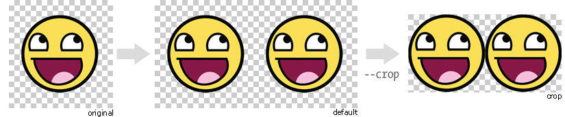

Command line arguments
======================

-s --simple
-----------
As it's explained at the :doc:`quickstart page <quickstart>` the default behaviour of ``glue`` is handle multi-sprite apps.

The suggested setup is create a new folder for every sprite, and add inside all the images you need for each one. ``glue`` will create a new sprite for every folder::

    images
    ├── actions
    │   ├── add.png
    │   └── remove.png
    ├── borders
    │   ├── top_left.png
    │   └── top_right.png
    └── icons
        ├── comment.png
        ├── new.png
        └── rss.png

The ``--simple`` argument ignores that behaviour and only expect that the ``source`` folder contains images like::

    animals
        ├── cat.css
        ├── snake.css
        ├── elephant.css
        └── dog.png

.. code-block:: bash

    $ glue source output --simple

-c --crop
---------

Usually designers add some unnecessary transparent space around the images because it is easier for them work with a larger canvas. ``glue`` can optimize our sprite croping all the unnecessary transparent spaces that the original images could have.

.. code-block:: bash

    $ glue source output --simple --crop

-l --less
---------
`less <http://lesscss.org/>`_  is a dynamic stylesheet language that extends CSS with dynamic behaviors.
``glue`` can also create ``.less`` files adding the ``--less`` option.
This files contains exactly the same CSS code. This option only changes the file format.

.. code-block:: bash

    $ glue source output --less

-u --url
---------
By default ``glue`` adds as url to the PNG file the relative url between the CSS and the PNG file. If for any reason you need to change this behaviour, you can use the ``url=<your-static-url-to-the-png-file>`` and ``glue`` will replace it's suggested one with your url.

.. code-block:: bash

    $ glue source output --url=http://static.example.com/

-q --quiet
----------
This flag will make ``glue`` suppress all console output.

.. code-block:: bash

    $ glue source output -q

-p --padding
------------
If you want to add the same padding around all the images you can use the ``--padding`` option to set the padding to all of them:

.. code-block:: bash

    $ glue source output --padding=10
    $ glue source output --padding=10 20
    $ glue source output --padding=10 20 30 40

--css --img
-----------
Usually both CSS and PNG files reside on different folders, `css` and `img` for example. If you want to choose an individual folder for each kind of file you can use the ``--img=<dir> --css=<dir>`` options together to customize where the output files will be created.

.. code-block:: bash

    $ glue source --img=images/compiled --css=css/compiled

-a --algorithm
--------------
The criteria that ``glue`` uses to order the images before adding them to the canvas can be tunned. By default the algorithm is `maxside` but in some situations using another ordering like `width`, `height` or `area` could be useful depending on the kind of images you are spriting.

The ordering algorithm was inspired by the `Binary Tree Bin Packing Algorithm Article <http://codeincomplete.com/posts/2011/5/7/bin_packing/>`_ by Jake Gordon.

.. code-block:: bash

    $ glue source output --algorithm=[maxside|width|height|area]

--namespace
-----------
By default ``glue`` adds the namespace ``sprite`` to all the generated CSS class names. if you want to use your own namespace you can override the default one using the ``--namespace`` option.

.. code-block:: bash

    $ glue source output --namespace=my-namespace

--ignore-filename-paddings
--------------------------
``glue`` by default uses the end of each filename to discover if you want to add some padding to that image. If for any reason you want to disable this behavior for legacy purporses, you can use the ``--ignore-filename-paddings`` option to disable it.

.. code-block:: bash

    $ glue source output --ignore-filename-paddings

--optipng
---------

OptiPNG is a PNG optimizer that recompresses image files to a smaller size, without losing any information.

OptiPNG is not a glue requirement but is hardly recomended to optimize the output PNG files to make them as small as possible.

If you have ``optipng`` installed on your computer you can use the  ``--optipng`` option to automatically optimize all the sprites that ``glue`` generates. if you don't know how to install it, read the :doc:`optipng page <optipng>`.

.. code-block:: bash

    $ glue source output --optipng

--optipngpath
-------------
If ``optipng`` is not in your computer ``PATH``, you can choose the optipng path using this option.

.. code-block:: bash

    $ glue source output --optipng --optipngpath=<dir>

--cachebuster
-------------
If you decide to add an expires header to your static resources (and if you haven't already you really should), you need to worry about cache busting these resources every time you change one of them.

Cache busting is a technique that prevents a browser from reusing a resource that was already downloaded and cached. Cache in general is good, but in some situations could be annoying if it's duration is too long and we want to update a resource **now**.

This technique adds a flag to every url that links an external resource (PNG in this case). This flag usually is the last modified time or the ``hash`` of the file.

``glue`` can use this technique to automatically add the ``hash`` of the PNG file to the CSS url, so as soon as the file change (add/remove an image) the ``hash`` will be different and the browser will re-dowload the image.

.. code-block:: bash

    $ glue source output --cachebuster

Original css:

.. code-block:: css

    .sprite-icons-zoom{ background:url('sprites/icons/icons.png'); top:0; left:0; no-repeat;}
    .sprite-icons-wrench_orange{ background:url('sprites/icons/icons.png'); top:0; left:-16; no-repeat;}
    ...

After --cachebuster:

.. code-block:: css

    .sprite-icons-zoom{ background:url('sprites/icons/icons.png=p3c54d'); top:0; left:0; no-repeat;}
    .sprite-icons-wrench_orange{ background:url('sprites/icons/icons.png?p3c54d'); top:0; left:-16; no-repeat;}
    ...
