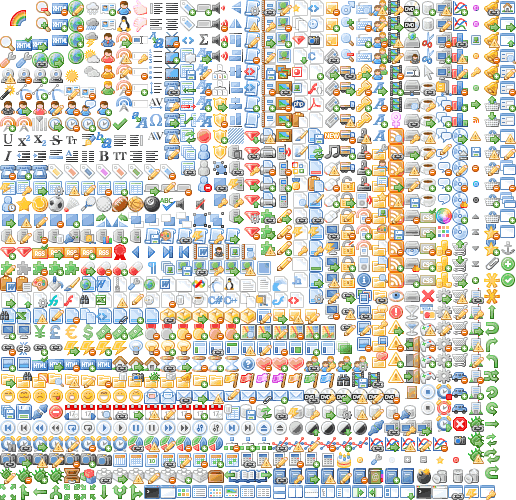

Paddings
========

In some situations it's really useful add some padding to an image. ``Glue`` will use the filename to determine the padding, so if we simply append ``_10`` to the filename it'll add a ``10px`` padding all around the image::

    $ mv rainbow.png rainbow_10.png
    $ glue icons sprites --simple

This small change will mean that the ``rainbow.png`` image needs a ``10px`` padding all arround the image.

If you don't need the same padding all arround the image, you can use ``_10_20`` for a ``10px 20px 10px 20px`` padding or
``_10_20_30_40`` for a ``10px 20px 30px 40px`` padding.

This padding information will not be used as part of the css class name so we can change the padding safely.

.. code-block:: css

    .sprite-icons-rainbow{ background:url('sprites/icons/icons.png'); top:0; left:0; no-repeat;}
    ...

