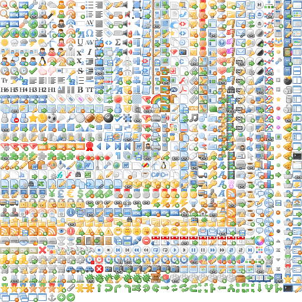
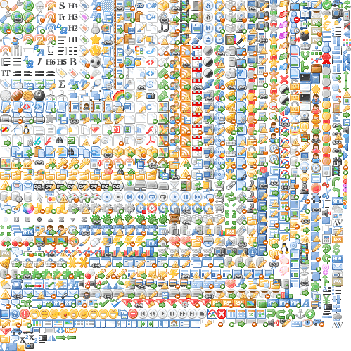

Quickstart
==========

After :doc:`installing <installation>` Glue you will have a new command named ``glue``.
You can check if it was correctly installed calling ``glue`` with the ``--help`` option to get the list of all the available :doc:`command line arguments <options>`::

    $ glue --help

If ``glue`` was correctly installed... Let's create your first sprite!

Your first sprite
-----------------

Create a new folder (``icons`` in this example), and add as many images as you want.
Then you can simply run the following command::

    $ glue icons sprites

Glue will create a new folder named ``sprites`` with the following structure::

    sprites
        ├── icons.css
        └── icons.png

For example using the gorgeous `famfamfam icons <http://www.famfamfam.com/lab/icons/silk/>`_ (4.2Mb) you will get
the following ``icons.png`` (401Kb).

The other file, ``icons.css`` will have all the necessary css classes for this sprite:

.. code-block:: css

    .sprite-icons-zoom_out{ background:url('sprites/icons/icons.png'); top:0; left:0; no-repeat;}
    .sprite-icons-zoom_in{ background:url('sprites/icons/icons.png'); top:0; left:-16; no-repeat;}
    .sprite-icons-zoom{ background:url('sprites/icons/icons.png'); top:-16; left:0; no-repeat;}
    .sprite-icons-xhtml_valid{ background:url('sprites/icons/icons.png'); top:-16; left:-16; no-repeat;}
    ...

And why those CSS class names?
-----------------------------------

As you can see, ``glue`` will use both the filename and the sprite name as part of the css class name. You can generate
the sprite as many times as you want on any computer and the CSS class related to a specific image will always be the same,
so you can create these sprites safely as part of your deployment process without being worried about css class name changes/collisions.

.. note::
    ``glue`` will only get alphanumeric, ``_`` and ``-`` characters from the filename to create the CSS class name.

For example, an imaginary ``animals`` sprite with 5 images will have the following class names.

=============== =========================
filename        css class name
=============== =========================
cat.png         .sprite-animals-cat
dog2.png        .sprite-animals-dog2
cat_blue.png    .sprite-animals-cat_blue
dog-red.png     .sprite-animals-dog-red
dog_(white).png .sprite-animals-dog_white
=============== =========================

If for any reason two images are to generate the same CSS class name, an error will be raised.

.. note::
    All CSS class names generated by ``glue`` will also have a namespace ``sprite-`` in the beginning. This namespace could be changed using the ``--namespace`` option.

Crop unnecessary transparent spaces
-----------------------------------

Usually designers add some unnecessary transparent space around the images because it is easier for them to work with a larger canvas. ``glue`` can optimize our sprite by cropping all the unnecessary transparent spaces that the original images could have before merging the images into the sprite.

.. image:: img/crop.png

.. code-block:: bash

    $ glue icons sprites --crop

The new ``icons.png`` (348Kb) will be 53Kb smaller.

Now, the css file will have the new coordinates but using the same css class names!

.. code-block:: css

    .sprite-icons-zoom{ background:url('sprites/icons/icons.png'); top:0; left:0; no-repeat;}
    .sprite-icons-wrench_orange{ background:url('sprites/icons/icons.png'); top:0; left:-16; no-repeat;}
    .sprite-icons-wrench{ background:url('sprites/icons/icons.png'); top:-16; left:0; no-repeat;}
    .sprite-icons-world_link{ background:url('sprites/icons/icons.png'); top:-16; left:-16; no-repeat;}
    ...

What about if I need to generate multiple sprites?
---------------------------------------------------

Usually an app has more than one sprite and generate all of them one by one could be annoying.

The suggested setup is to create a new folder for every sprite, and add inside all the images you need for each one. ``glue`` will create a new sprite for every folder if you use the ``--project`` argument::

    images
    ├── actions
    │   ├── add.png
    │   └── remove.png
    ├── borders
    │   ├── top_left.png
    │   └── top_right.png
    └── icons
        ├── comment.png
        ├── new.png
        └── rss.png

So now, running::

    $ glue images sprites --project

Will generate a new ``sprites`` folder with the images and the css inside::

    sprites
        ├── actions.png
        ├── actions.css
        ├── borders.png
        ├── borders.css
        ├── icons.png
        └── icons.css

And now?
-----------------------------------
``glue`` have some more magical powers inside!

* :doc:`Retina sprites <ratios>`: Do you want to make your sprites look good on any device? Read the :doc:`ratios documentation <ratios>`.
* Glue can also read the configuration from :doc:`static config files <files>`.
* We support `less <http://lesscss.org/>`_! It's easy, add ``--less`` and ``glue`` will generate the CSS file with the ``.less`` extension.
* Cache Busting? Yes! Add ``--cachebuster`` and ``glue`` will add the ``SHA1`` of the PNG sprite as a queryarg on the CSS files. Read the :doc:`options` page.
* We support `OptiPNG <http://optipng.sourceforge.net/>`_ to automatically optimize the PNG sprites. Read the :doc:`options` page.
* Still hungry? Read the :doc:`options` page to discover all the available settings.
