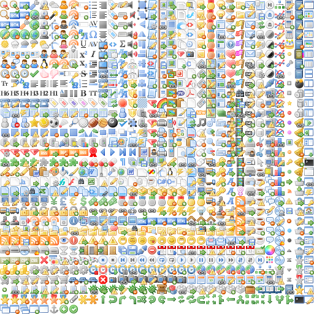

Quickstart
==========

After :doc:`installing <installation>` ``glue`` you will have a new command named ``glue``.
You can check if it was correclty installed calling ``glue`` with the ``--help`` argument to get the list of all the available :doc:`optional arguments <arguments>`::

    $ glue --help

If ``glue`` was correctly installed... Let's create your first sprite!

Your first sprite
-----------------

Create a new folder (``icons`` in this example) and add as many images as you want.
Then you can simply run the following command::

    $ glue icons --simple

Glue will create a new folder named ``sprites`` next to the original ``icons`` folder with the following structure::

    sprites
    └── icons
        ├── icons.css
        └── icons.png

For example using the gorgeous `famfamfam icons <http://www.famfamfam.com/lab/icons/silk/>`_ (4.2Mb) we will get
the following ``icons.png`` (401Kb).

The other file, ``icons.css`` will have all the neccesary css classes for this sprite:

.. code-block:: css

    .sprite-icons-zoom_out{ background:url('sprites/icons/icons.png'); top:0; left:0; no-repeat;}
    .sprite-icons-zoom_in{ background:url('sprites/icons/icons.png'); top:0; left:-16; no-repeat;}
    .sprite-icons-zoom{ background:url('sprites/icons/icons.png'); top:-16; left:0; no-repeat;}
    .sprite-icons-xhtml_valid{ background:url('sprites/icons/icons.png'); top:-16; left:-16; no-repeat;}
    ...

And why this css class names?
-----------------------------------

As you can see, ``glue`` will use the filename and the sprite name as part of the css class name. You can generate
the sprite as many times as you want on any computer and the css class related to one image will be always the same,
so you can create this sprites safely as part of your deployment process without being worried about css class name collisions.

``Glue`` will only get from the filename the alphanumeric, ``_`` and ``-`` characters to create the css class name.

For example, an imaginary ``animals`` sprite with this 5 images will have the following class names.

=============== =========================
filename        css class name
=============== =========================
cat.png         .sprite-animals-cat
dog2.png        .sprite-animals-dog2
cat_blue.png    .sprite-animals-cat_blue
dog-red.png     .sprite-animals-dog-red
dog_(white).png .sprite-animals-dog_white
=============== =========================

If for any reason two images are going to use the same css class name, and error will be raised.

Crop unnecessary transparent spaces
-----------------------------------

``Glue`` can optimize our sprite croping all the unnecessary transparent spaces that the original icons have::

    $ glue icons --simple --crop

The new ``icons.png`` (348Kb) will be 53Kb smaller.

.. image:: _static/famfamfam2.png

Now, the css file will have the new coordinates but using the same css class names!

.. code-block:: css

    .sprite-icons-zoom{ background:url('sprites/icons/icons.png'); top:0; left:0; no-repeat;}
    .sprite-icons-wrench_orange{ background:url('sprites/icons/icons.png'); top:0; left:-16; no-repeat;}
    .sprite-icons-wrench{ background:url('sprites/icons/icons.png'); top:-16; left:0; no-repeat;}
    .sprite-icons-world_link{ background:url('sprites/icons/icons.png'); top:-16; left:-16; no-repeat;}
    ...

What about the --simple parameter?
-----------------------------------

Weird no? Well... usually a single app have more than one sprite, so the default behaviour of ``glue`` is handle
multiple sprites smoothly.

The suggested setup is create a new folder for every sprite, and add inside all the images you need for each one. ``Glue`` will create a new sprite for every folder::

    images
    ├── actions
    │   ├── add.png
    │   └── remove.png
    ├── borders
    │   ├── top_left.png
    │   └── top_right.png
    └── icons
        ├── comment.png
        ├── new.png
        └── rss.png

So now, running::

    $ glue images

Will generate a new ``sprites`` folder with the images and the css inside::

    sprites
    ├── actions
    │   ├── actions.png
    │   └── actions.css
    ├── borders
    │   ├── borders.png
    │   └── borders.css
    └── icons
        ├── icons.png
        └── icons.css

And now?
-----------------------------------
``Glue`` have some more magical powers inside!

* We support `less <http://lesscss.org/>`_. It's easy, add ``--less`` and ``glue`` will also generate the ``.less`` files!
* You can add paddings to your images only changing the filename! Read the :doc:`paddings documentation <paddings>`.
* Glue can also read the configuration from :doc:`static config files <files>`.
* Different problems have different solutions. You can choose different ordering algorithms for the images. Read the :doc:`arguments documentation <arguments>`.
* Still hungry? Read the :doc:`arguments documentation <arguments>` to discover all the available settings.
