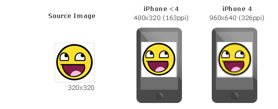
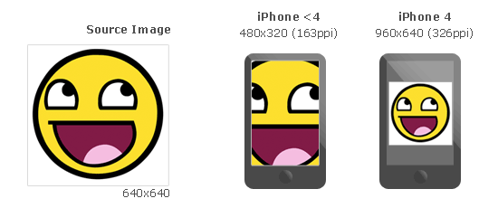
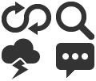

Retina Sprites: Ratios
=======================

What is this for?
------------------

These days, some devices like the iPhone 4, or the new Macbook Pro have screens with higher pixel density than usual. For example iPhone4's Retina Display doubles the pixel density we use to see on handheld devices.

This change improves the sharpness of vector graphics, but not images... Why? These devices scale vector graphics like text without losing quality, but in order to make images bigger, images are automatically pixel-doubled like in the following example.

**How can we solve this problem with high DPI devices?**
Basically, provide two different version of each image.

**And... how can we detect wich image should we use?** CSS Media Queries. Modern browsers `(anything after IE 8.0) <http://caniuse.com/#feat=css-mediaqueries>`_ supports them, and they allow us to specify different styles based on the ``device-pixel-ratio`` of the browser.

**Can glue help?** Yes, using ``--ratios`` you can choose different ratios you want to build of each sprite. Glue will create one sprite for each ratio and will add all the neccesary CSS magic to make the browser use the high DPI image if the browser needs it. You can also use ``--retina``, it's a shortcut for ``--ration=2,1``.

How --retina and --ratios work?
-------------------------------

As ``glue`` cannot do magic scaling up the source images, **it assumes that these images are the biggests you want to serve**. *(i.e. For iPhone 4 Retina these images should be 2x the final size you want)*, then glue will create one sprite for each ratio you set in the command line or only ``2x`` if you use ``--retina``::

    $ glue icons sprites --retina

This command will generate the following files::

    sprites
    ├── icons.css
    ├── icons.png
    └── icons@2x.png

    icons.png

    icons\@2x.png

And this will be the content of ``icons.css``:

.. code-block:: css

    .sprite-sprites-loopback,
    .sprite-sprites-weather,
    .sprite-sprites-magnify,
    .sprite-sprites-chat{
        background-image:url(sprites.png);
        background-repeat:no-repeat
    }

    .sprite-sprites-loopback{ background-position:-1px -1px;width:32px;height:21px; }
    .sprite-sprites-weather{ background-position:-1px -24px;width:24px;height:26px; }
    .sprite-sprites-magnify{ background-position:-35px -1px;width:24px;height:24px; }
    .sprite-sprites-chat{ background-position:-35px -27px;width:24px;height:22px; }

    @media only screen and (-webkit-min-device-pixel-ratio: 2.0),
           only screen and (min--moz-device-pixel-ratio: 2.0),
           only screen and (-o-min-device-pixel-ratio: 200/100),
           only screen and (min-device-pixel-ratio: 2.0) {
            .sprite-sprites-loopback,
            .sprite-sprites-weather,
            .sprite-sprites-magnify,
            .sprite-sprites-chat{
                background-image:url(sprites@2x.png);
                -webkit-background-size: 60px 51px;
                -moz-background-size: 60px 51px;
                background-size: 60px 51px;
            }
    }

What about if I need some other ratios?
---------------------------------------

The option ``--retina`` is only a shortcut for ``--ratios=2,1``. You can manually use ``--ratios=A,B,C...`` to create different ones.
For example you can use ``--ratios=2,1.5,1`` to make glue build three diferent sprites::

    sprites
    ├── icons.css
    ├── icons.png
    ├── icons@1.5.png
    └── icons@2x.png

Wich ratios should I target?
----------------------------

Is up to you, but using ``2`` and ``1.5`` should be enough for most of the devices.

Here you have a list of suggested ratios for some famous devices, `(full list) <http://en.wikipedia.org/wiki/List_of_displays_by_pixel_density>`_:

========================= =================== =============== ================
Device                    Screen size         dpi             Suggested ratio
========================= =================== =============== ================
**iPad**                  **2048 × 1536**     **264ppi**      **2**
**iPhone 5/5S/5C**        **1136 × 640**      **326ppi**      **2**
**iPhone 4**              **960 × 640**       **326ppi**      **2**
**iPhone 4S**             **960 × 640**       **326ppi**      **2**
**iPad (3rd gen)**        **2048 × 1536**     **264ppi**      **2**
**MacBook Retina**        **2880 x 1800**     **220ppi**      **2**
**Xperia S**              **720 × 1280**      **342ppi**      **2**
**One X**                 **720 × 1280**      **312ppi**      **2**
**EVO LTE**               **720 × 1280**      **312ppi**      **2**
**Galaxy Note**           **800 × 1280**      **285ppi**      **2**
**Galaxy SIII**           **720 × 1280**      **306ppi**      **2**
**Galaxy S4**             **1080 × 1920**     **441ppi**      **3**
**Galaxy Nexus**          **720 × 1280**      **316ppi**      **2**
**Nexus 4**               **768 × 1280**      **320ppi**      **2**
**Nexus 5**               **1920 x 1080**     **445ppi**      **3**
**Kindle Fire HDX 8.9**   **2560 x 1600**     **339ppi**      **1.5**
**Kindle Fire HD  8.9**   **1920 x 1200**     **254ppi**      **1.5**
HTC Desire                480 × 800           252ppi          1.5
Nexus One                 480 × 800           252ppi          1.5
Sensation                 960 × 540           256ppi          1.5
Evo 3D                    960 × 540           256ppi          1.5
Sensation XE              960 × 540           256ppi          1.5
LG Optimus 2X             480 × 800           233ppi          1.5
Defy+                     854 × 480           265ppi          1.5
Milestone                 480 × 854           265ppi          1.5
Nexus S SAMOLED           480 × 800           235ppi          1.5
Nexus S LCD               480 × 800           235ppi          1.5
Galaxy S Plus             480 x 800           233ppi          1.5
Galaxy SII                480 × 800           219ppi          1.5
Galaxy Tab                600 × 1024          171ppi          1.5
iPad mini                 1024 × 768          163ppi          1
iPhone                    480 × 320           163ppi          1
iPhone 3G                 480 × 320           163ppi          1
iPhone 3GS                480 × 320           163ppi          1
iPad (1st gen)            1024 × 768          132ppi          1
iPad 2                    1024 × 768          132ppi          1
Kidle Fire                1024 × 600          169ppi          1
Galaxy Y (S5360)          240 × 320           133ppi          0.75
========================= =================== =============== ================
